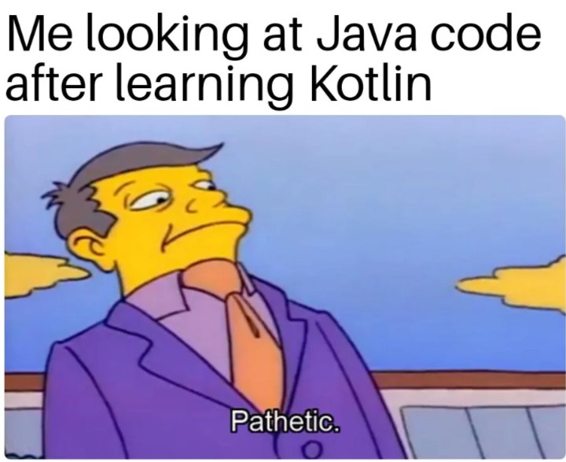
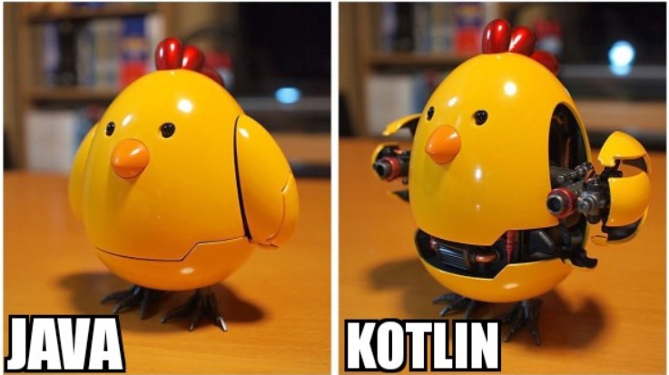

<!-- _class: title -->

# Kotlin Basics
<br/>

[Moeein Aali](https://github.com/MoeeinAali/)
Sharif University of Technology
CE244 - Advanced Programming - Fall 2024
Mr. Hamidreza Hosseinkhani

---




---

<!-- _class: tinytext -->

# Variable Type

To create a variable, use `var` or `val`, and assign a value to it with the equal sign `=`:
```kotlin
var name = "Moeein"           // String (text)
val birthyear = 1382        // Int (number)
```

**The difference between `var` and `val` is that variables declared with the var keyword can be changed/modified, while `val` variables cannot**

it is possible to specify the type if you insist:
```kotlin
var name: String = "Moeein"   // String
val birthyear: Int = 1382   // Int
```
---

<!-- _class: tinytext -->

# Data Types

In Kotlin, the type of a variable is decided by its value:
```kotlin
val myNum: Int = 5                // Int
val myDoubleNum: Double = 5.99    // Double
val myLetter: Char = 'D'          // Char
val myBoolean: Boolean = true     // Boolean
val myText: String = "Hello"      // String
```
Data types are divided into different groups:
- Numbers
  - Byte - Short - Int - Long - Float - Double
- Characters
- Booleans
- Strings
- Arrays

To convert a numeric data type to another type, you must use one of the following functions: 
`toByte()`, `toShort()`, `toInt()`, `toLong()`, `toFloat()`, `toDouble()` or `toChar()`

---

<!-- _class: tinytext -->

# Arithmetic Operators

| Operator | Name          | Description                        | Example   |
|----------|---------------|------------------------------------|-----------|
| `+`      | Addition      | Adds together two values           | `x + y`   |
| `-`      | Subtraction   | Subtracts one value from another   | `x - y`   |
| `*`      | Multiplication| Multiplies two values              | `x * y`   |
| `/`      | Division      | Divides one value from another     | `x / y`   |
| `%`      | Modulus       | Returns the division remainder     | `x % y`   |
| `++`     | Increment     | Increases the value by 1           | `++x`     |
| `--`     | Decrement     | Decreases the value by 1           | `--x`     |

---

<!-- _class: tinytext -->

# Assignment Operators

| Operator | Example   | Same As        |
|----------|-----------|----------------|
| `=`      | `x = 5`   | `x = 5`        |
| `+=`     | `x += 3`  | `x = x + 3`    |
| `-=`     | `x -= 3`  | `x = x - 3`    |
| `*=`     | `x *= 3`  | `x = x * 3`    |
| `/=`     | `x /= 3`  | `x = x / 3`    |
| `%=`     | `x %= 3`  | `x = x % 3`    |

---

<!-- _class: tinytext -->

# Comparison Operators

| Operator | Name                        | Example   |
|----------|-----------------------------|-----------|
| `==`     | Equal to                   | `x == y`  |
| `!=`     | Not equal                  | `x != y`  |
| `>`      | Greater than               | `x > y`   |
| `<`      | Less than                  | `x < y`   |
| `>=`     | Greater than or equal to   | `x >= y`  |
| `<=`     | Less than or equal to      | `x <= y`  |

---

<!-- _class: tinytext -->

# Logical Operators

| Operator | Name          | Description                                   | Example           |
|----------|---------------|-----------------------------------------------|-------------------|
| `&&`     | Logical and   | Returns `true` if both statements are true    | `x<5 && x<10` |
| `\|\|`     | Logical or    | Returns `true` if one of the statements is true| `x<5 \|\| x<4`  |
| `!`      | Logical not   | Reverses the result; returns `false` if true  | `!(x<5)`        |

---

<!-- _class: tinytext -->

# Strings

Strings are used for storing text.

A string contains a collection of characters surrounded by double quotes:
```kotlin
var greeting = "Hello"
```

This will generate an error:
```kotlin
var name
name = "John"
println(name)
```
This works fine:
```kotlin
var name: String
name = "John"
println(name)
```
---

<!-- _class: tinytext -->

# Strings

## Access a String

To access the characters (elements) of a string, you must refer to the index number inside square brackets.

String indexes start with 0. In the example below, we access the first and third element in `txt`:

```kotlin
var txt = "Hello World"
println(txt[0]) // first element (H)
println(txt[2]) // third element (l)
```

A String in Kotlin is an object, which contain properties and functions that can perform certain operations on strings, by writing a dot character (.) after the specific string variable. For example, the `length` of a string can be found with the length property:

```kotlin
var txt = "ABCDEFGHIJKLMNOPQRSTUVWXYZ"
println("The length of the txt string is: " + txt.length)
```

---

<!-- _class: tinytext -->

# Strings

## Comparing Strings

The `compareTo(string)` function compares two strings and returns 0 if both are equal:

```kotlin
var txt1 = "Hello World"
var txt2 = "Hello World"
println(txt1.compareTo(txt2))  // Outputs 0 (they are equal)
```

---


<!-- _class: tinytext -->

# Strings

## Finding a String in a String

The `indexOf()` function returns the index (the position) of the first occurrence of a specified text in a string (including whitespace):

```kotlin
var txt = "Please locate where 'locate' occurs!"
println(txt.indexOf("locate"))  // Outputs 7
```

---


<!-- _class: tinytext -->

# Strings

## String Concatenation

The `+` operator can be used between strings to add them together to make a new string. This is called concatenation:


```kotlin
var firstName = "John"
var lastName = "Doe"
println(firstName + " " + lastName)
```
You can also use the `plus()` function to concatenate two strings:

```kotlin
var firstName = "John "
var lastName = "Doe"
println(firstName.plus(lastName))
```

---

<!-- _class: tinytext -->

# Strings

## String Templates/Interpolation

Instead of concatenation, you can also use "string templates", which is an easy way to add variables and expressions inside a string.

Just refer to the variable with the `$` symbol:

```kotlin
var firstName = "John"
var lastName = "Doe"
println("My name is $firstName $lastName")
```

---
<!-- _class: tinytext -->

# Booleans

A boolean type can be declared with the `Boolean` keyword and can only take the values `true` or `false`:


```kotlin
val isKotlinFun: Boolean = true
val isFishTasty: Boolean = false
println(isKotlinFun)   // Outputs true
println(isFishTasty)   // Outputs false 
```

Just like you have learned with other data types in the previous chapters, the example above can also be written without specifying the type, as Kotlin is smart enough to understand that the variables are Booleans:

```kotlin
val isKotlinFun = true
val isFishTasty = false
println(isKotlinFun)   // Outputs true
println(isFishTasty)   // Outputs false 
```

---
<!-- _class: tinytext -->

# Booleans

## Boolean Expression
A Boolean expression returns a Boolean value: `true` or `false`.

You can use a comparison operator, such as the greater than (`>`) operator to find out if an expression (or a variable) is true:

```kotlin
val x = 10
val y = 9
println(x > y) // Returns true, because 10 is greater than 9
```

In the examples below, we use the equal to (==) operator to evaluate an expression:

```kotlin
val x = 10;
println(x == 10); // Returns true, because the value of x is equal to 10
```

```kotlin
println(10 == 15); // Returns false, because 10 is not equal to 15
```

---
<!-- _class: tinytext -->

# If ... Else

Kotlin has the following conditionals:

- Use `if` to specify a block of code to be executed, if a specified condition is true
- Use `else` to specify a block of code to be executed, if the same condition is false
- Use `else if` to specify a new condition to test, if the first condition is false
- Use `when` to specify many alternative blocks of code to be executed

```kotlin
if (condition1) {
  // block of code to be executed if condition1 is true
} else if (condition2) {
  // block of code to be executed if the condition1 is false and condition2 is true
} else {
  // block of code to be executed if the condition1 is false and condition2 is false
}
```
**When using `if` as an expression, you must also include `else` (required).**

---


<!-- _class: tinytext -->

# If ... Else Expressions


In Kotlin, you can also use `if..else` statements as expressions (assign a value to a variable and return it):


```kotlin
val time = 20
val greeting = if (time < 18) {
  "Good day."
} else {
  "Good evening."
}
println(greeting)
```

Note: You can ommit the curly braces `{}` when `if` has only one statement:
```kotlin
fun main() {
  val time = 20
  val greeting = if (time < 18) "Good day." else "Good evening."
  println(greeting)
}
```

---


<!-- _class: tinytext -->

# Kotlin When

Instead of writing many `if..else` expressions, you can use the `when` expression, which is much easier to read.

It is used to select one of many code blocks to be executed:

```kotlin
val day = 4

val result = when (day) {
  1 -> "Monday"
  2 -> "Tuesday"
  3 -> "Wednesday"
  4 -> "Thursday"
  5 -> "Friday"
  6 -> "Saturday"
  7 -> "Sunday"
  else -> "Invalid day."
}
println(result)

// Outputs "Thursday" (day 4)
```

---

<!-- _class: tinytext -->

# Kotlin When

- The `when` variable (day) is evaluated once
- The value of the day variable is compared with the values of each "branch"
- Each branch starts with a value, followed by an arrow (->) and a result
- If there is a match, the associated block of code is executed
- `else` is used to specify some code to run if there is no match
- In the example above, the value of `day` is `4`, meaning "Thursday" will be printed

---

<!-- _class: tinytext -->

# Kotlin While Loop

Loops can execute a block of code as long as a specified condition is reached.

Loops are handy because they save time, reduce errors, and they make code more readable.

```kotlin
var i = 0
while (i < 5) {
  println(i)
  i++
} 
```

**Note: Do not forget to increase the variable used in the condition, otherwise the loop will never end.**

---

<!-- _class: tinytext -->

# Kotlin Break

The `break` statement is used to jump out of a **loop**.\

```kotlin
var i = 0
while (i < 10) {
  println(i)
  i++
  if (i == 4) {
    break
  }
}
```

---

<!-- _class: tinytext -->

# Kotlin labelled break

```kotlin
fun main(args: Array<String>) {
    var num1 = 4
    outer@ while (num1 > 0) {
        var num2 = 4
        inner@ while (num2 > 0) {
            if (num1==2)
                break@outer
            println("num1 = $num1, num2 = $num2")
            num2--
        }
        num1--
    }
}
```

---

<!-- _class: tinytext -->

# Kotlin Continue

The `continue` statement breaks one iteration (in the loop), if a specified condition occurs, and continues with the next iteration in the loop.

This example skips the value of 4:
```kotlin
var i = 0
while (i < 10) {
  if (i == 4) {
    i++
    continue
  }
  println(i)
  i++
}
```

---

<!-- _class: tinytext -->

# Kotlin labelled continue

```kotlin
fun main(args: Array<String>) {
    var num1 = 4
    outer@ while (num1 > 0) {
        num1--
        var num2 = 4
        inner@ while (num2 > 0) {
            if (num1 <= 2)
                continue@outer
            println("num1 = $num1, num2 = $num2")
            num2--
        }
    }
}
```

---

<!-- _class: tinytext -->

# Kotlin Arrays

Arrays are used to store multiple values in a single variable, instead of creating separate variables for each value.

To create an array, use the `arrayOf()` function, and place the values in a comma-separated list inside it:

```kotlin
val cars = arrayOf("Volvo", "BMW", "Ford", "Mazda")

```

---

<!-- _class: tinytext -->

# Kotlin Arrays

### Access the Elements of an Array

You can access an array element by referring to the index number, inside square brackets.

In this example, we access the value of the first element in cars:

```kotlin
val cars = arrayOf("Volvo", "BMW", "Ford", "Mazda")
println(cars[0])
// Outputs Volvo 
```

---

<!-- _class: tinytext -->

# Kotlin Arrays

### Change an Array Element

To change the value of a specific element, refer to the index number:

```kotlin
val cars = arrayOf("Volvo", "BMW", "Ford", "Mazda")
cars[0] = "Opel"
println(cars[0])
// Now outputs Opel instead of Volvo
```

---

<!-- _class: tinytext -->

# Kotlin Arrays

### Array Length / Size


To find out how many elements an array have, use the `size` property:

```kotlin
val cars = arrayOf("Volvo", "BMW", "Ford", "Mazda")
println(cars.size)
// Outputs 4 
```

---


<!-- _class: tinytext -->

# Kotlin For Loop

Often when you work with arrays, you need to loop through all of the elements.

To loop through array elements, use the `for` loop together with the `in` operator:

```kotlin
val cars = arrayOf("Volvo", "BMW", "Ford", "Mazda")
for (x in cars) {
  println(x)
}
```
You can loop through all kinds of arrays. In the example above, we used an array of strings.

In the example below, we loop through an array of integers:
```kotlin
val nums = arrayOf(1, 5, 10, 15, 20)
for (x in nums) {
  println(x)
}
```

---

<!-- _class: tinytext -->

# Kotlin do-while loop

```kotlin
do {
      // code to run
}
while(condition)
```


---

<!-- _class: tinytext -->

# Kotlin Ranges

With the `for` loop, you can also create **ranges** of values with `..`:

```kotlin
for (chars in 'a'..'x') {
  println(chars)
}
```
You can also create ranges of numbers:
```kotlin
for (nums in 5..15) {
  println(nums)
} 
```
**Note: The first and last value is included in the range.**

---


<!-- _class: tinytext -->

# Kotlin Ranges

### Check if a Value Exists

You can also use the `in` operator to check if a value exists in a range:
```kotlin
val nums = arrayOf(2, 4, 6, 8)
if (2 in nums) {
  println("It exists!")
} else {
  println("It does not exist.")
}
```

---

<!-- _class: tinytext -->

# Kotlin Ranges

### Check if a Value Exists

You can also use the `in` operator to check if a value exists in a range:
```kotlin
val nums = arrayOf(2, 4, 6, 8)
if (2 in nums) {
  println("It exists!")
} else {
  println("It does not exist.")
}
```


---


---


<!-- _class: tinytext -->

# Kotlin Functions

To create your own function, use the `fun` keyword, and write the name of the function, followed by parantheses ():

```kotlin
fun myFunction() {
  println("I just got executed!")
} 
```
To call a function in Kotlin, write the name of the function followed by two parantheses ().
```kotlin
fun main() {
  myFunction() // Call myFunction
}
```

---

<!-- _class: tinytext -->

# Kotlin Functions

### Function Parameters

Parameters are specified after the function name, inside the parentheses. You can add as many parameters as you want, just separate them with a comma. Just note that you must specify the type of each parameter (Int, String, etc).

The following example has a function that takes a `String` called fname as parameter. When the function is called, we pass along a first name, which is used inside the function to print the full name:

```kotlin
fun myFunction(fname: String) {
  println(fname + " Doe")
}
```

When a **parameter** is passed to the function, it is called an **argument**. So, from the example above: `fname` is a **parameter**, while `John`, `Jane` and `George` are **arguments**.

---

<!-- _class: tinytext -->

# Kotlin Functions

### Return Values

In the examples above, we used functions to output a value. In the following example, we will use a function to **return** a value and assign it to a variable.

To return a value, use the `return` keyword, and specify the **return type** after the function's parantheses (`Int` in this example):

```kotlin
fun myFunction(x: Int): Int {
  return (x + 5)
}

fun main() {
  var result = myFunction(3)
  println(result)
}
```
---

<!-- _class: tinytext -->

# Kotlin Functions

### Default and Named argument

```kotlin
fun greet(name: String = "World") {
    println("Hello, $name!")
}
// Call with argument
greet("John") // Output: Hello, John!
// Call without argument
greet() // Output: Hello, World!
```

---

<!-- _class: tinytext -->

# Kotlin Functions

### Shorter Syntax for Return Values

There is also a shorter syntax for returning values. You can use the `=` operator instead of `return` without specifying the return type. Kotlin is smart enough to automatically find out what it is:

```kotlin
fun myFunction(x: Int, y: Int) = x + y

fun main() {
  var result = myFunction(3, 5)
  println(result)
}
```
---

<!-- _class: tinytext -->

# Kotlin Classes/Objects

### Create a Class

To create a class, use the `class` keyword, and specify the name of the class:

Create a Car class along with some properties (brand, model and year)

```kotlin
class Car {
  var brand = ""
  var model = ""
  var year = 0
} 
```

---

<!-- _class: tinytext -->

# Kotlin Classes/Objects

### Create an Object

Now we can use the class named Car to create objects.

In the example below, we create an object of Car called c1, and then we access the properties of c1 by using the dot syntax (.), just like we did to access array and string properties:

```kotlin
// Access the properties and add some values to it
c1.brand = "Ford"
c1.model = "Mustang"
c1.year = 1969

println(c1.brand)   // Outputs Ford
println(c1.model)   // Outputs Mustang
println(c1.year)    // Outputs 1969 
```

---

<!-- _class: tinytext -->

# Kotlin Constructor

A constructor is like a special function, and it is defined by using two parantheses `()` after the class name. You can specify the properties inside of the parantheses (like passing parameters into a regular function).

The constructor will initialize the properties when you create an object of a class. Just remember to specify the type of the property/variable:

```kotlin
class Car(var brand: String, var model: String, var year: Int)

fun main() {
  val c1 = Car("Ford", "Mustang", 1969)
}
```

---

<!-- _class: tinytext -->

# Kotlin Class Functions

You can also use functions inside a class, to perfom certain actions:

```kotlin
class Car(var brand: String, var model: String, var year: Int) {
  // Class function
  fun drive() {
    println("Wrooom!")
  }
}

fun main() {
  val c1 = Car("Ford", "Mustang", 1969)
  
  // Call the function
  c1.drive()
}
```

Note: When an object of the class is created, it has access to all of the class functions.

---

# Kotlin Inheritance

In Kotlin, it is possible to inherit class properties and functions from one class to another. We group the "inheritance concept" into two categories:

- **subclass** (child) - the class that inherits from another class
- **superclass** (parent) - the class being inherited from


---

<!-- _class: tinytext -->

# Kotlin Inheritance

```kotlin
// Superclass
open class MyParentClass {
  val x = 5
}

// Subclass
class MyChildClass: MyParentClass() {
  fun myFunction() {
    println(x) // x is now inherited from the superclass
  }
}

// Create an object of MyChildClass and call myFunction
fun main() {
  val myObj = MyChildClass()
  myObj.myFunction()
} 
```
---

<!-- _class: tinytext -->

# Comparison of Map Types in Kotlin

| Type           | Mutability      |
|----------------|-----------------|
| `mapOf`        | Immutable       |
| `mutableMapOf` | Mutable         |
| `hashMapOf`    | Mutable         | 
| `linkedMapOf`  | Mutable         |
| `sortedMapOf`  | Mutable         |


---


<!-- _class: tinytext -->

# Comparison of Map Types in Kotlin

## Notes:
- **Immutable vs Mutable**: Immutable maps (`mapOf`) cannot be modified after creation, whereas mutable maps allow dynamic additions, updates, and deletions.
- **Key Order**: Only `linkedMapOf` and `sortedMapOf` preserve order, with `sortedMapOf` specifically maintaining a sorted order.
- **Performance**: `hashMapOf` is optimized for quick lookups but doesn't preserve order, whereas `linkedMapOf` is slightly slower but maintains insertion order.

---

<!-- _class: tinytext -->

# Comparison of List Types in Kotlin

| Type            | Mutability      | Order Preservation | Duplicate Elements |
|-----------------|-----------------|--------------------|--------------------|
| `listOf`        | Immutable       | ✅ Preserved       | ✅ Allowed         |
| `mutableListOf` | Mutable         | ✅ Preserved       | ✅ Allowed         |
| `arrayListOf`   | Mutable         | ✅ Preserved       | ✅ Allowed         |
| `arrayOf`       | Mutable         | ✅ Preserved       | ✅ Allowed         |
| `linkedList`    | Mutable         | ✅ Preserved       | ✅ Allowed         |

---

<!-- _class: tinytext -->

# Comparison of List Types in Kotlin


## Notes:
- **Immutable vs Mutable**: `listOf` creates an immutable list, whereas `mutableListOf` and `arrayListOf` are mutable.
- **Order Preservation**: All lists preserve the order of elements as inserted.
- **Performance**:
  - `arrayListOf` (backed by `ArrayList`) is faster for random access and general operations.
  - `linkedList` (from Java's `LinkedList`) is better for frequent insertions and deletions but slower for random access.
- **Duplicates**: All Kotlin list types allow duplicate elements by default.

---

<!-- _class: tinytext -->

# Comparison of Set Types in Kotlin

| Type            | Mutability      | Order Preservation | Performance   | 
|-----------------|-----------------|--------------------|---------------|
| `setOf`         | Immutable       | ❌ Not preserved  | ✅ Efficient  |
| `mutableSetOf`  | Mutable         | ❌ Not preserved  | ✅ Efficient  | 
| `hashSetOf`     | Mutable         | ❌ Not preserved  | ✅ Fast       | 
| `linkedSetOf`   | Mutable         | ✅ Preserved      | ✅ Efficient  | 
| `sortedSetOf`   | Mutable         | ✅ Sorted order   | ✅ Fast       | 

---

<!-- _class: tinytext -->

# Comparison of Set Types in Kotlin


## Notes:
- **Immutable vs Mutable**: `setOf` is immutable and cannot be modified after creation, whereas `mutableSetOf`, `hashSetOf`, and others are mutable.
- **Order Preservation**:
  - `linkedSetOf` preserves the insertion order.
  - `sortedSetOf` keeps elements sorted (based on natural ordering or a comparator).
  - `hashSetOf` and `mutableSetOf` do not guarantee order.
- **Duplicates**: Sets in Kotlin do not allow duplicate elements by definition.
- **Performance**:
  - `hashSetOf` provides the best performance for lookups and modifications but does not maintain order.
  - `linkedSetOf` is slightly slower than `hashSetOf` but preserves order.
  - `sortedSetOf` has higher overhead due to sorting but is useful when order by value is required.

---

<!-- _class: tinytext -->

# Abstract Class in Kotlin

```kotlin
abstract class Animal {
    abstract fun makeSound() // Abstract method (no implementation)

    fun sleep() { // Concrete method
        println("Sleeping...")
    }
}
class Dog : Animal() {
    override fun makeSound() { // Implementation of the abstract method
        println("Woof!")
    }
}
fun main() {
    val dog = Dog()
    dog.makeSound() // Output: Woof!
    dog.sleep()     // Output: Sleeping...
}
```

---

<!-- _class: tinytext -->

# Enum Classes in Kotlin

```kotlin
enum DAYS {SUNDAY,MONDAY,TUESDAY,WEDNESDAY,THURSDAY,FRIDAY,SATURDAY}

public class Main {
    public static void main(String[] args) {
        // A simple demonstration of properties and methods
        for (DAYS day : DAYS.values()) {
            System.out.println(day.ordinal() + " = " + day.name());
        }
        System.out.println(DAYS.valueOf("WEDNESDAY"));
    }
}
```

---

<!-- _class: tinytext -->

# Enum Classes in Kotlin

```kotlin
// A property with default value provided
enum class DAYS(val isWeekend: Boolean = false){
    SUNDAY(true),
    MONDAY,
    TUESDAY,
    WEDNESDAY,
    THURSDAY,
    FRIDAY,
    // Default value overridden
    SATURDAY(true);
 
    companion object{
        fun today(obj: DAYS): Boolean {
            return obj.name.compareTo("SATURDAY") == 0 || obj.name.compareTo("SUNDAY") == 0
        }
    }
}
 
fun main(){
    // A simple demonstration of properties and methods
    for(day in DAYS.values()) {
        println("${day.ordinal} = ${day.name} and is weekend ${day.isWeekend}")
    }
    val today = DAYS.MONDAY;
    println("Is today a weekend ${DAYS.today(today)}")
}
```

---

<!-- _class: tinytext -->

# Enum Classes in Kotlin

```kotlin
// defining enum class
enum class Seasons(var weather: String) {
    Summer("hot"){
        // compile time error if not override the function foo()
        override fun foo() {              
            println("Hot days of a year")
        }
    },
    Winter("cold"){
        override fun foo() {
            println("Cold days of a year")
        }
    },
    Rainy("moderate"){
        override fun foo() {
            println("Rainy days of a year")
        }
    };
    abstract fun foo()
}
// main function
fun main(args: Array<String>) {
    // calling foo() function override be Summer constant
    Seasons.Summer.foo() 
}
```

---


<!-- _class: tinytext -->

# Enum Classes in Kotlin

```kotlin
enum class DAYS{
    SUNDAY,
    MONDAY,
    TUESDAY,
    WEDNESDAY,
    THURSDAY,
    FRIDAY,
    SATURDAY;
}
 
fun main(){
    when(DAYS.SUNDAY){
        DAYS.SUNDAY -> println("Today is Sunday")
        DAYS.MONDAY -> println("Today is Monday")
        DAYS.TUESDAY -> println("Today is Tuesday")
        DAYS.WEDNESDAY -> println("Today is Wednesday")
        DAYS.THURSDAY -> println("Today is Thursday")
        DAYS.FRIDAY -> println("Today is Friday")
        DAYS.SATURDAY -> println("Today is Saturday")
        // Adding an else clause will generate a warning
    }
}
```

---


<!-- _class: tinytext -->

# Pair in Kotlin

#### Creating a Pair
```kotlin
val pair = Pair("Alice", 25)
println("Name: ${pair.first}, Age: ${pair.second}")
```
#### Alternative Syntax with `to`
```kotlin
val pair = "Alice" to 25
println("Name: ${pair.first}, Age: ${pair.second}")
```
---





---

# Kotlin Exception Handling

- `try`: Wraps the code that may throw exceptions.
- `catch`: Handles specific exceptions that occur in the try block.
- `finally`: Executes cleanup code (optional, runs whether an exception occurs or not).
- `throw`: Explicitly throws an exception.

---

<!-- _class: tinytext -->

# Kotlin Exception Handling

```kotlin
fun main() {
    try {
        val result = divide(10, 0)
        println("Result: $result")
    } catch (e: ArithmeticException) {
        println("Caught an exception: ${e.message}")
    } finally {
        println("Finally block always executes.")
    }
}

fun divide(a: Int, b: Int): Int {
    if (b == 0) {
        throw ArithmeticException("Cannot divide by zero") // Explicitly throwing an exception
    }
    return a / b
}
```

---


<!-- _class: tinytext -->

# Kotlin Exception Handling

You can handle different exceptions using multiple `catch` blocks:
```kotlin
fun main() {
    try {
        val array = arrayOf(1, 2, 3)
        println(array[5]) // Throws ArrayIndexOutOfBoundsException
    } catch (e: ArithmeticException) {
        println("Arithmetic exception caught: ${e.message}")
    } catch (e: ArrayIndexOutOfBoundsException) {
        println("Array index out of bounds: ${e.message}")
    } catch (e: Exception) { // Generic exception handler
        println("General exception caught: ${e.message}")
    }
}
```

---


<!-- _class: tinytext -->

# Kotlin Exception Handling

You can define and throw custom exceptions in Kotlin:
```kotlin
class InvalidAgeException(message: String) : Exception(message)

fun checkAge(age: Int) {
    if (age < 18) {
        throw InvalidAgeException("Age must be at least 18")
    }
    println("Age is valid")
}

fun main() {
    try {
        checkAge(16)
    } catch (e: InvalidAgeException) {
        println("Caught custom exception: ${e.message}")
    }
}
```

---

# Kotlin Null Safety

Nullable and Non-Nullable Types:
```kotlin
val nonNullable: String = "Hello" // Cannot be null
val nullable: String? = null      // Can hold null
```
Safe Call Operator `?.`:
```kotlin
val length = nullable?.length // Returns null if 'nullable' is null
```
Elvis Operator `?:`:
```kotlin
val length = nullable?.length ?: 0 // Returns 0 if 'nullable' is null
```

---

# Kotlin Null Safety

Not-Null Assertion `!!`:
```kotlin
val length = nullable!!.length // Risky! Throws NPE if 'nullable' is null
```
Safe Cast `as?`:
```kotlin
val number: Int? = "123" as? Int // Returns null
```

---

# Kotlin on Android


---